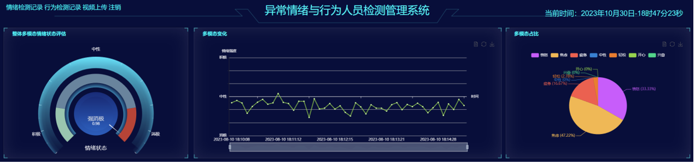

# Research_on_Comprehensive_Human_Emotion_and_Behavior_Assessment_System
# CHEBAS：Research on Comprehensive Human Emotion and Behavior Assessment System: Multimodal Emotion Recognition Combining Audio-Visual Inputs and Image Analysis Techniques for Behavioral Identification

With the rapid advancement of artificial intelligence and computer vision technologies, comprehensive assessment of human emotions and behavior has become a hot topic in contemporary scientific research. Traditional emotion recognition and behavior analysis often rely on single-modality data inputs, such as solely using images or audio. This approach often falls short in achieving desired accuracy and adaptability in complex real-world applications. To address this issue, we have developed a multimodal emotion recognition system that integrates audio and video inputs for a more comprehensive capture of subtle changes in human emotions. Additionally, we utilize advanced image analysis technology for behavior recognition, enabling a more accurate and in-depth understanding of human actions. Recognizing the inadequacies of existing emotion recognition technologies in practical multi-dimensional analysis, we have designed a novel multi-dimensional emotional and behavioral analysis model algorithm architecture. This architecture is capable of processing voice, text, images, and combinations of these modalities for conducting emotion analysis and behavior recognition. Experimental results demonstrate the significant effectiveness of our method in emotion and behavior recognition. Currently, specific emotional analysis applications lack a guiding architectural framework. Therefore, we have designed an end-to-end emotional and behavior recognition system, aiming to provide a new practical example for emotion and behavior recognition. This system is not only applicable in scenarios such as recommendation systems and abnormal emotion diagnosis but also offers new reference patterns for practical emotional applications.
# Performance
Figure 1: Visual feature extraction block diagram.

Figure 2: Personnel Detection Information Entry and Video Recording Preservation.

Figure 3: Emotion Detection Record.

Figure 4: Visual Analysis of Emotion Recognition Results in Facial Expression, Voice, and Text Modalities.

Figure 5: Visual Analysis of Multimodal Emotion Recognition Results.

Figure 6: Behavior Monitoring Record.

Figure 7: Visual Analysis of Emotion Recognition Results from Behavioral Modalities.

Figure 8: Emotional Assessment Report.

Figure 9: Behavior Assessment Report.

